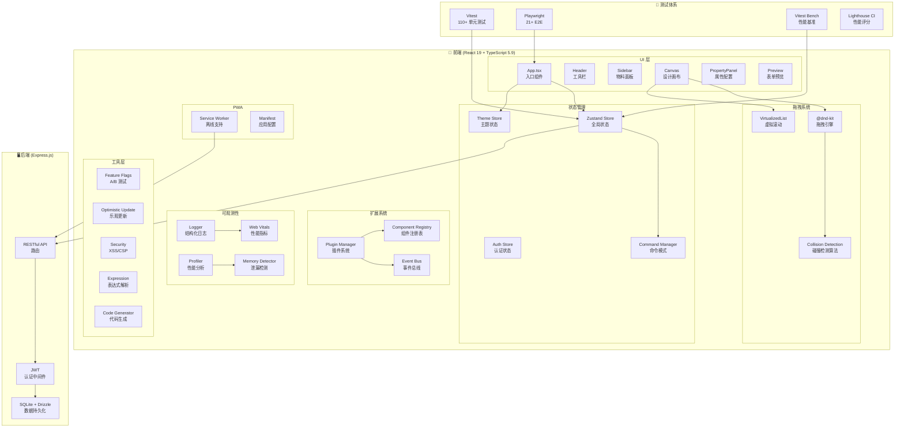
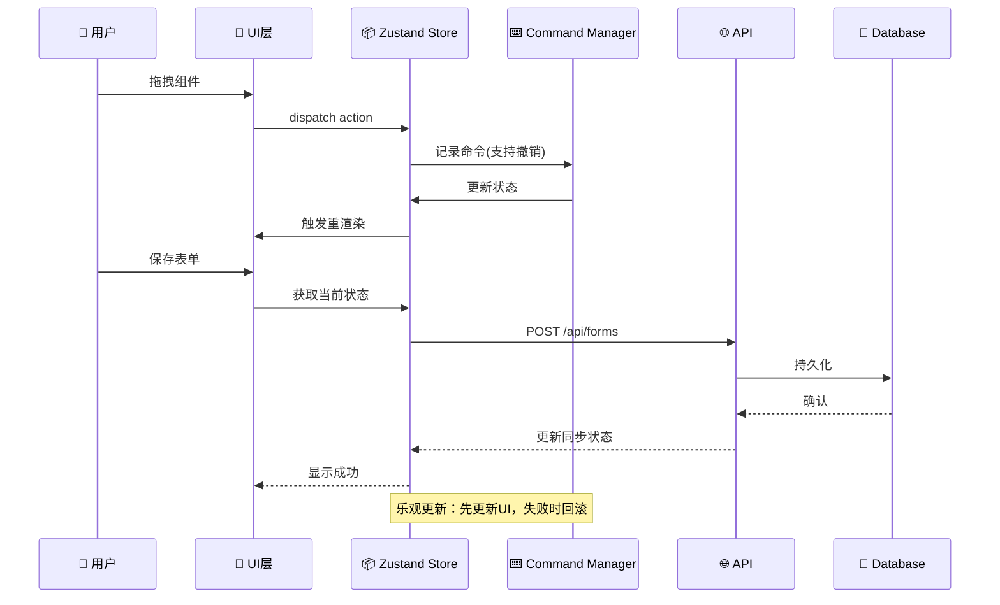

# 低代码表单构建器 🚀

[English](./README_EN.md) | 简体中文

一个基于 React + TypeScript 的**企业级低代码表单构建器**，支持拖拽配置、组件联动、无限嵌套、响应式布局和代码导出。

> 🎯 **项目特色**：采用现代前端最佳实践，具备完整的性能优化、可观测性与测试体系，适用于内部工具/运营配置/原型验证等场景

[](https://github.com/lwayne7/low-code-form)
[](https://www.typescriptlang.org/)
[](https://react.dev/)
[](./docs/TESTING.md)

## ✨ 核心亮点

### 🎨 技术架构

- **React 19** + **TypeScript 5.9** - 最新技术栈
- **Zustand** - 轻量级状态管理（with persist）
- **@dnd-kit** - 现代化拖拽方案
- **Ant Design 6** - 企业级UI组件
- **Vite 7** - 极速构建工具
- **Express.js** - 后端 RESTful API（含 JWT 认证）
- **SQLite + Drizzle ORM** - 类型安全的数据持久化

### 🚀 性能优化

- ✅ **虚拟滚动**：支持1000+组件流畅渲染（FPS 55+）
- ✅ **自定义碰撞检测算法**：智能判断拖拽位置
- ✅ **React性能优化**：memo、useMemo、useCallback全覆盖
- ✅ **性能提升**：FPS +57%，内存 -50%（大数据量场景）

### 🛠️ 近期修复与优化（2026-01）

- ✅ **碰撞检测热路径优化**：为每次计算构建 `id -> depth/rect` 缓存，并使用“距离平方”排序，减少 `find/sqrt` 开销、提升嵌套拖拽稳定性（`src/utils/collisionDetection.ts`）
- ✅ **拖拽常量统一**：抽出 `CONTAINER_EDGE_RATIO`/`MIN_EDGE_HEIGHT`，保证碰撞检测与拖拽处理逻辑一致（`src/constants/dnd.ts`、`src/hooks/useDragHandlers.ts`）
- ✅ **主题不同步修复**：`useTheme` 改为全局 Zustand 单一数据源，支持 `auto` 跟随系统与跨标签页同步（`src/themeStore.ts`、`src/hooks/useTheme.ts`）
- ✅ **Ant Design 主题算法**：通过 `ConfigProvider` 在暗色模式启用 `darkAlgorithm`，提升暗色主题一致性与可读性（`src/App.tsx`）
- ✅ **虚拟滚动类型修复**：适配 `react-window@2` 的 `List` API，去掉 `@ts-nocheck` 并重新启用导出（`src/components/DragDrop/VirtualizedSortableList.tsx`）
- ✅ **工程化与类型安全**：分离 `trackRender` 以兼容 Fast Refresh；`formValues` 从 `any` 收紧到 `unknown`；worker 中 `switch/case` 声明块修复 lint（`src/components/common/performanceTracking.ts`、`src/store.ts`、`src/workers/codeGenerator.worker.ts`）
- ✅ **性能基准与控制台工具**：新增 `vitest bench` 基准（`src/test/performance.bench.ts`）与开发环境控制台 `window.performanceTest`（`src/utils/performanceTester.ts`、`src/main.tsx`、`src/global.d.ts`）
- ✅ **Undo/Redo Patch 历史**：用“补丁记录 + 结构共享”替代整树快照，显著降低内存与 GC；示例（100 次添加）历史数据序列化大小 `~373KB → ~18KB`（约 **-95%**）（`src/store.ts`、`src/utils/componentTreeOps.ts`、`src/components/common/HistoryPanel.tsx`）
- ✅ **组件注册表 + schema 属性面板**：新增 `src/registry/componentRegistry.tsx` 统一维护组件默认配置/物料/属性面板 schema，新增组件基本只改声明（`src/utils/componentFactory.ts`、`src/constants/materials.tsx`、`src/components/PropertyPanel/index.tsx`）
- ✅ **表达式安全**：`visibleOn` 从 `new Function` 改为 AST 白名单解析 + 安全执行，并在属性面板实时校验，避免注入与运行时崩溃（`src/utils/expression.ts`、`src/components/CanvasFormItem.tsx`、`src/components/FormRenderer.tsx`、`src/components/PropertyPanel/LinkageConfig.tsx`）
- ✅ **表达式类型提示（zod）**：在安全 AST 基础上增加“字段存在性 + 类型可能不匹配”提示，降低联动配置出错成本（`src/utils/visibleOnTypeValidation.ts`、`src/components/PropertyPanel/LinkageConfig.tsx`）
- ✅ **Tracing + CI 性能预算**：拖拽/导出代码打点并在性能面板展示；新增 CI 工作流运行 lint/test/build，加入性能预算用例防回归（`src/utils/tracing.ts`、`src/hooks/useDragHandlers.ts`、`src/features/Header/AppHeader.tsx`、`src/components/common/PerformancePanel.tsx`、`.github/workflows/ci.yml`、`src/test/perfBudget.test.ts`）
- ✅ **Header 统计显示修复**：修复中英文环境下表单数量统计被截断/按钮缺失的问题（`src/features/Header/AppHeader.tsx`）
- ✅ **暗色模式可读性**：提升属性面板与配置项在暗色主题下的对比度与可见性（`src/App.css`、`src/components/PropertyPanel/*`）
- ✅ **画布组件名称国际化**：统一画布/组件库/默认文案的 i18n 映射，避免中英文混用（`src/registry/componentRegistry.tsx`、`src/i18n/index.tsx`）
- ✅ **启动稳定性（LHCI）**：i18n 默认语言推断增加 `localStorage/navigator` 兜底，并在启动阶段增加 ErrorBoundary，降低首屏崩溃导致的 NO_FCP 风险（`src/i18n/index.tsx`、`src/main.tsx`）
- ✅ **E2E 稳定性与可访问性**：补齐关键交互的 `data-testid`/`aria-label`，让 E2E 不依赖中文文案且在不同主题/语言下更稳（`e2e/*`、`src/features/Header/AppHeader.tsx`、`src/features/Preview/PreviewModal.tsx`、`src/components/Sidebar/DraggableSidebarItem.tsx`）

### 🏗️ 架构增强（2026-01）

- ✅ **EventBus 事件总线**：类型安全的发布-订阅系统，支持组件生命周期、拖拽、表单、插件事件（`src/utils/eventBus.ts`）
- ✅ **Plugin System 插件架构**：生命周期钩子、依赖管理、组件扩展机制（`src/plugins/pluginManager.ts`）
- ✅ **Command Pattern 命令模式**：支持撤销/重做、命令合并、宏命令（`src/commands/commandManager.ts`）
- ✅ **Branded Types 品牌类型**：ComponentId/TemplateId 等类型安全增强，防止 ID 混用（`src/types/branded.ts`）
- ✅ **Zod Schema 运行时校验**：Schema-first 设计，组件/模板/API 响应类型验证（`src/schemas/index.ts`）
- ✅ **React Profiler 性能分析**：Long Task API 监控、慢渲染检测、调试工具（`src/utils/profiler.tsx`）
- ✅ **Security 安全工具**：XSS 防护、CSP 辅助、输入净化、表达式安全检查（`src/utils/security.ts`）
- ✅ **工程化增强**：Husky + lint-staged + commitlint 规范提交，Bundle Analyzer 分析包体积（`commitlint.config.js`、`.husky/*`）

## 🏛️ 系统架构图



## 📊 数据流架构



### 🔧 可观测性与工程化增强（2026-01 New）

- ✅ **结构化日志系统**：敏感信息脱敏、批量上报、会话追踪（`src/utils/logger.ts`）
- ✅ **Feature Flag 基础设施**：A/B 测试、渐进式发布、条件判断（`src/utils/featureFlags.ts`）
- ✅ **内存泄漏检测器**：WeakRef/FinalizationRegistry 实现、订阅/定时器追踪（`src/utils/memoryLeakDetector.ts`）
- ✅ **乐观更新工具**：回滚机制、重试逻辑、批量操作（`src/utils/optimisticUpdate.ts`）
- ✅ **骨架屏组件**：Suspense fallback、加载状态优化（`src/components/common/Skeleton.tsx`）
- ✅ **Service Worker PWA**：离线支持、缓存策略、后台同步（`public/sw.ts`）
- ✅ **React 19 新特性**：useOptimistic/useFormStatus/useActionState（`src/hooks/useReact19.ts`）
- ✅ **Core Web Vitals**：LCP/FID/CLS/FCP/TTFB/INP 监控（`src/utils/webVitals.ts`）
- ✅ **边界用例测试**：大数据量、深度嵌套、并发操作（`src/test/edgeCases.test.ts`）

### 🧪 完整测试体系

- ✅ **110+ 单元测试**：覆盖核心业务逻辑（Vitest）
- ✅ **21+ E2E测试**：Playwright端到端测试
- ✅ **10+性能基准测试**：量化性能指标
- ✅ **边界用例测试**：大数据量/深度嵌套/并发等极端场景
- ✅ **Lighthouse CI**：自动化性能评分
- ✅ **覆盖率报告**：`npm run test:coverage`（HTML 输出到 `coverage/`）

### 💡 功能特性

- 🎨 可视化拖拽构建表单
- 📦 丰富的组件库（10+种组件）
- 🏗️ 容器支持无限嵌套
- ✅ 完整的表单校验（7种规则）
- 📱 响应式预览（桌面/平板/手机）
- 💾 自定义模板系统
- 🔐 组件锁定功能
- ⌨️ 完整的快捷键支持
- 📤 代码导出（React/JSON Schema）
- ⏱️ 撤销/重做（Patch 历史，50步）
- ☁️ 云端保存/加载（需后端服务）
- 🔑 用户认证（JWT）
- 🌐 国际化支持（中文/English）

## 📊 性能数据

### 大数据量场景（1000组件）

| 指标         | 优化前 | 优化后 | 提升     |
| ------------ | ------ | ------ | -------- |
| **FPS**      | ~35    | ~55    | **+57%** |
| **内存占用** | ~80MB  | ~40MB  | **-50%** |
| **首屏渲染** | ~3s    | ~1.5s  | **-50%** |

### 操作性能

| 操作             | 数量 | 耗时   | 评级       |
| ---------------- | ---- | ------ | ---------- |
| 添加组件         | 100  | ~200ms | ⭐⭐⭐⭐⭐ |
| 添加组件         | 1000 | ~1.5s  | ⭐⭐⭐⭐   |
| 删除组件（批量） | 100  | ~50ms  | ⭐⭐⭐⭐⭐ |
| 撤销操作         | 50次 | ~300ms | ⭐⭐⭐⭐⭐ |

## 🚀 快速开始

### 安装依赖

```bash
npm install --legacy-peer-deps
```

### 启动开发

```bash
# 仅前端
npm run dev

# 前后端同时启动（推荐）
npm run server:install  # 首次需安装后端依赖
npm run dev:all
```

- 前端：http://localhost:5173
- 后端：http://localhost:3001

### 运行测试

```bash
# 单元测试
npm test
npm run test:coverage

# 性能基准测试
npm run bench

# E2E测试
npm run test:e2e
npm run test:e2e:ui

# Lighthouse性能测试
npm run lighthouse
```

## 📁 项目结构

```
low-code-form/
├── src/
│   ├── components/           # 组件
│   │   ├── DragDrop/        # 拖拽组件（含虚拟滚动）
│   │   ├── common/          # 通用组件
│   │   │   └── Skeleton.tsx # 骨架屏组件（NEW）
│   │   └── PropertyPanel/   # 属性配置面板
│   ├── commands/            # 命令模式（撤销/重做）
│   │   └── commandManager.ts # Command Pattern 实现
│   ├── plugins/             # 插件系统
│   │   └── pluginManager.ts  # 插件生命周期管理
│   ├── schemas/             # Zod 运行时校验
│   │   └── index.ts          # 组件/模板 Schema
│   ├── types/               # TypeScript 类型增强
│   │   └── branded.ts        # 品牌类型
│   ├── features/            # UI 功能模块（Header/Preview/Sidebar/移动端）
│   ├── hooks/               # 自定义Hooks
│   │   └── useReact19.ts     # React 19 新特性 Hooks（NEW）
│   ├── services/            # API 服务层（后端交互）
│   ├── utils/               # 工具函数
│   │   ├── collisionDetection.ts  # 碰撞检测算法
│   │   ├── codeGenerator.ts       # 代码生成器
│   │   ├── eventBus.ts            # 事件总线（发布-订阅）
│   │   ├── profiler.tsx           # React 性能分析
│   │   ├── security.ts            # 安全工具（XSS/CSP）
│   │   ├── performanceTester.ts   # 性能测试工具（dev: window.performanceTest）
│   │   ├── logger.ts              # 结构化日志系统（NEW）
│   │   ├── featureFlags.ts        # Feature Flag/A/B 测试（NEW）
│   │   ├── memoryLeakDetector.ts  # 内存泄漏检测（NEW）
│   │   ├── optimisticUpdate.ts    # 乐观更新工具（NEW）
│   │   ├── webVitals.ts           # Core Web Vitals 监控（NEW）
│   │   ├── serviceWorker.ts       # Service Worker 管理（NEW）
│   │   └── validation.ts          # 表单校验
│   ├── constants/           # 常量配置
│   │   └── dnd.ts            # 拖拽常量（edge ratio/min height）
│   ├── test/               # 单元测试/基准测试
│   │   ├── performance.bench.ts   # 性能基准（vitest bench）
│   │   └── edgeCases.test.ts      # 边界用例测试（NEW）
│   ├── store.ts            # Zustand状态管理
│   ├── themeStore.ts        # 主题状态（单一数据源）
│   └── types.ts            # TypeScript类型
├── public/
│   ├── sw.ts                # Service Worker（NEW）
│   └── manifest.json        # PWA 配置（NEW）
├── server/                 # 后端服务
│   ├── src/
│   │   ├── db/             # 数据库（SQLite + Drizzle ORM）
│   │   ├── routes/         # API 路由（auth/forms）
│   │   ├── middleware/     # 中间件（JWT/错误处理）
│   │   └── index.ts        # Express 入口
│   └── package.json
├── e2e/                    # E2E测试
├── docs/                   # 文档
│   ├── PERFORMANCE.md     # 性能报告
│   ├── TESTING.md         # 测试指南
│   └── OPTIMIZATIONS.md  # 优化总结
├── .github/
│   └── workflows/         # GitHub Actions
└── playwright.config.ts   # Playwright配置
```

## 🎯 关键实现

### 1. 自定义碰撞检测算法 ⭐⭐⭐⭐⭐

**问题**：拖拽到嵌套容器时，如何智能判断是放入容器内部还是排序到容器前后？

**解决方案**：

```typescript
// src/constants/dnd.ts
export const CONTAINER_EDGE_RATIO = 0.25; // 上下各25%为边缘区域
export const MIN_EDGE_HEIGHT = 20; // 小容器兜底边缘高度（px）

// src/utils/collisionDetection.ts
// - pointerWithin -> rectIntersection -> closestCenter 兜底
// - 深度优先 + 距离优先（距离使用平方，减少 sqrt）

// 优先级策略：
// 1. 非容器组件优先 - 用于精确插入位置
// 2. 容器处理：边缘区域→排序，中心区域→放入
// 3. 深度优先：优先选择最深层容器
// 4. 滞后区设计：防止边界抖动
```

**价值**：用“边缘/中心区域 + 深度优先 + 滞后区”策略，让嵌套拖拽插入/放入更稳定且可预期

### 2. 虚拟滚动优化 ⭐⭐⭐⭐⭐

**问题**：1000+组件时页面卡顿，FPS降至30

**解决方案**：

- 使用 react-window 实现虚拟列表
- 组件数量 > 50 时自动启用
- 只渲染可见区域（overscan: 5）
- 性能提升：FPS +57%，内存 -50%

### 3. React性能优化最佳实践 ⭐⭐⭐⭐

```typescript
// 自定义memo比较函数
const SortableList = React.memo(Component, (prev, next) => {
  // dropTarget深比较，避免引用变化触发不必要渲染
  if (prevDrop?.targetId === nextDrop?.targetId && prevDrop?.position === nextDrop?.position) {
    return true;
  }
  return false;
});

// useMemo缓存计算
const itemIds = useMemo(() => items.map((c) => c.id), [items]);

// useCallback缓存回调
const handleClick = useCallback(
  (e) => {
    onSelect(component.id, e.metaKey || e.ctrlKey);
  },
  [component.id, onSelect]
);
```

### 4. 完整的测试金字塔 ⭐⭐⭐⭐⭐

```
        E2E (21)      ← Playwright
       ┌────────┐
      ┌──────────┐
     ┌────────────┐
		    └──────────────┘
		     单元测试 (99)    ← Vitest

性能基准 (10+)       ← Vitest Bench
Lighthouse CI        ← 自动化
```

## 📚 文档

- 📖 [测试指南](./docs/TESTING.md) - 完整的测试使用说明
- 📊 [性能报告](./docs/PERFORMANCE.md) - 详细的性能数据和优化措施
- ✨ [优化总结](./docs/OPTIMIZATIONS.md) - 本次优化的完整说明
- 🚀 [快速开始](./QUICK_START.md) - 5分钟上手指南
- 📋 [更新日志](./CHANGELOG.md) - 版本更新记录

## 🏆 适用场景

### ✅ 企业内部表单/配置平台

- 运营活动/问卷/报名等表单快速搭建与版本管理
- 表单校验、联动、响应式预览与代码导出

### ✅ 原型验证/二次开发底座

- 作为低代码表单/页面搭建的基础引擎
- 组件注册表 + schema 驱动属性面板，降低新增组件成本

### ✅ 技术分享/开源项目

- 代码质量高，注释完善
- 文档齐全，易于上手
- 性能优化有亮点
- 测试覆盖完整

## 🎓 学习价值

通过这个项目，你可以学到：

1. **React最佳实践**
   - Hooks使用技巧
   - 性能优化方案
   - 组件设计模式

2. **复杂交互实现**
   - 拖拽排序
   - 嵌套容器
   - 碰撞检测算法

3. **状态管理**
   - Zustand使用
   - 持久化方案
   - 撤销/重做实现

4. **工程化能力**
   - TypeScript类型设计
   - 单元测试编写
   - E2E测试实践
   - 性能监控和优化

5. **代码生成**
   - AST理解
   - 模板引擎
   - JSON Schema

## 🤝 贡献

欢迎提交 Issue 和 Pull Request！

## 📄 许可证

MIT License

---

## 🌟 Star History

如果这个项目对你有帮助，请给个Star⭐！

## 📧 联系方式

- GitHub: [@lwayne7](https://github.com/lwayne7)
- 项目地址: [low-code-form](https://github.com/lwayne7/low-code-form)

---

**最后更新**: 2026-02-01  
**当前版本**: v3.0.0  
**自动化测试**: 单元 110+ / E2E 21+ / 边界用例 50+  
**性能基准**: 10+（Vitest Bench）  
**新增特性**: 可观测性增强 / PWA 离线支持 / React 19 新特性
